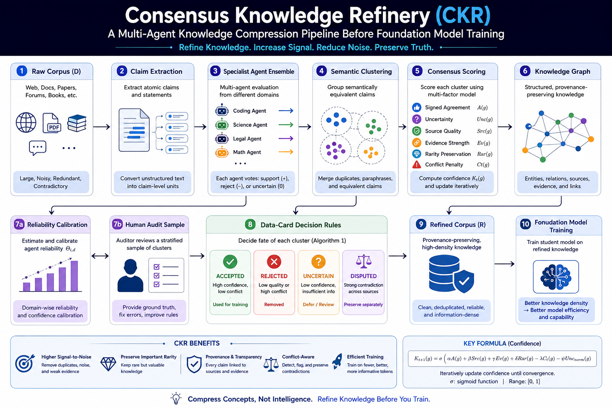

# Consensus Knowledge Refinery

[](https://doi.org/10.5281/zenodo.20760380)

**Consensus Knowledge Refinery (CKR)** is a research proposal for refining raw corpora into higher-density, provenance-aware knowledge before foundation model training.

**Status:** Research Proposal v1.0  
**Paper:** *Consensus Knowledge Refinery: A Technical Proposal for Multi-Agent Knowledge Compression Before Foundation Model Training*  
**Author:** Akash Pawar  
**DOI:** [10.5281/zenodo.20760380](https://doi.org/10.5281/zenodo.20760380)

## Abstract Summary

CKR proposes a pre-training data refinement layer that processes raw text before it is used to train a foundation model. The proposal hypothesizes that multi-agent review, semantic clustering, consensus scoring, provenance tracking, and human audit workflows may improve the knowledge density and reliability of training corpora.

This repository contains the Zenodo preprint, supporting documentation, an architecture overview, a roadmap, and an example data-card schema. It does not present completed empirical results.

## CKR Pipeline Overview

```text
Raw Corpus
  -> Claim Extraction
  -> Specialist Agent Ensemble
  -> Semantic Clustering
  -> Consensus Scoring
  -> Knowledge Graph
  -> Reliability Calibration
  -> Human Audit
  -> Data-Card Decision Rules
  -> Refined Corpus
```

Pipeline diagram:



## Key Components

- **Raw corpus:** Unrefined source material collected for possible training use.
- **Claim extraction:** Candidate factual, procedural, or explanatory claims are extracted from source documents.
- **Specialist agent ensemble:** Multiple reviewer agents evaluate claims from different perspectives.
- **Semantic clustering:** Similar claims are grouped to reduce duplication and compare competing statements.
- **Consensus scoring:** Claims receive confidence estimates based on agreement, provenance, uncertainty, and conflict signals.
- **Knowledge graph:** Accepted, disputed, and related claims are linked for traceability and contradiction detection.
- **Reliability calibration:** Scores are adjusted using evidence quality, source reliability, rarity, and audit feedback.
- **Human audit:** Selected claims and edge cases are reviewed by humans before final inclusion decisions.
- **Data-card decision rules:** Structured metadata controls whether a claim is accepted, rejected, disputed, or queued for review.
- **Refined corpus:** The output corpus is intended for future training experiments and validation.

## Repository Structure

```text
.
├── README.md
├── LICENSE
├── paper/
│   └── Consensus_Knowledge_Refinery_v1.pdf
├── diagrams/
│   └── ckr_pipeline.png
├── docs/
│   ├── architecture.md
│   └── roadmap.md
└── examples/
    └── sample_datacard.json
```

## Roadmap

- **Phase 1:** Claim extraction prototype
- **Phase 2:** Data-card schema implementation
- **Phase 3:** Consensus scoring
- **Phase 4:** Knowledge graph and contradiction detection
- **Phase 5:** Human audit workflow
- **Phase 6:** Small model experiments
- **Phase 7:** Scaling validation

See [docs/roadmap.md](docs/roadmap.md) for the detailed roadmap.

## Citation

If you reference this proposal, please cite the Zenodo preprint:

```bibtex
@misc{pawar2026consensusknowledgerefinery,
  title        = {Consensus Knowledge Refinery: A Technical Proposal for Multi-Agent Knowledge Compression Before Foundation Model Training},
  author       = {Pawar, Akash},
  year         = {2026},
  publisher    = {Zenodo},
  doi          = {10.5281/zenodo.20760380},
  url          = {https://doi.org/10.5281/zenodo.20760380},
  note         = {Research Proposal v1.0}
}
```

## License

The paper, diagrams, and documentation in this repository are licensed under the Creative Commons Attribution 4.0 International License (CC BY 4.0). See [LICENSE](LICENSE).

If implementation code is added in the future, it may be licensed separately under the MIT License.

## Disclaimer

CKR is a research proposal and technical hypothesis. It is not a completed empirical result, production system, or proven training method. Any performance, reliability, or efficiency claims require future experiments, reproducible evaluation, and independent validation.
